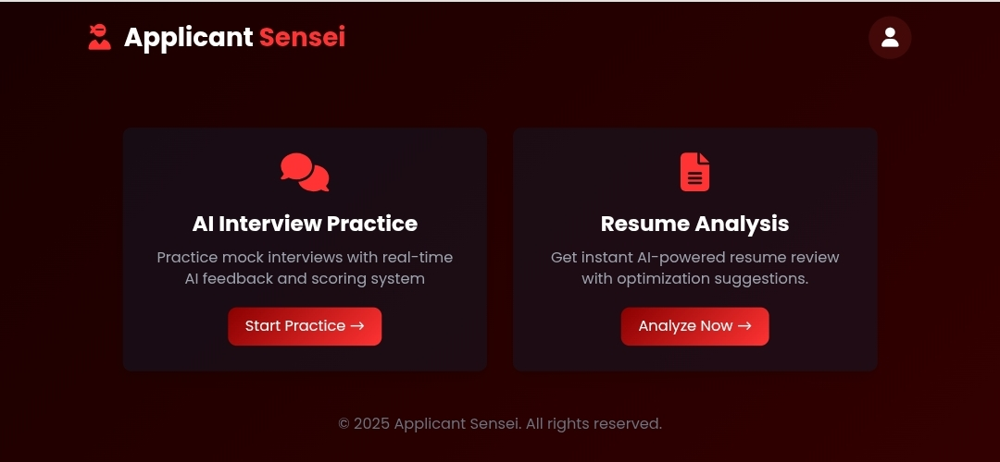

# Applicant Sensei - AI Career Assistant (Demo)



[](https://reactjs.org/)
[](https://tailwindcss.com/)
[](https://babeljs.io/)
[](https://fontawesome.com/)
[](https://developer.mozilla.org/en-US/docs/Web/Progressive_web_apps/Responsive/Mobile_first)
[](https://www.w3.org/WAI/standards-guidelines/wcag/)
[](https://jwt.io/)

## Overview

Applicant Sensei is an AI-powered career assistant designed to help job seekers navigate the modern hiring landscape. It combines technical resume optimization with emotional interview preparation through:

- **AI Interview Practice**: Mock interviews with real-time feedback and scoring
- **Smart Resume Analysis**: Instant AI-powered review with optimization suggestions
- **Adaptive Learning**: Adjusts difficulty based on user performance

## Key Features

### Interview Preparation
- Practice with industry-specific questions
- Real-time feedback on speech clarity and answer structure
- STAR method framework guidance
- Simulated high-pressure interview environments

### Resume Optimization
- ATS (Applicant Tracking System) compatibility scoring
- Keyword gap analysis from job descriptions
- Readability improvements
- Quantifiable achievement suggestions

## Tech Stack

### Frontend
- **React.js** - Component-based UI
- **Tailwind CSS** - Utility-first styling
- **Font Awesome** - Icon library
- **CSS Animations** - Engaging user interactions
- **Responsive Design** - Mobile-first approach

### Backend (Planned)
- **Node.js/Express** - API Gateway
- **Python NLP** - Resume parsing
- **TensorFlow.js** - Interview simulations
- **JWT Authentication** - Secure access

## Development Principles

[](https://github.com/ryanmcdermott/clean-code-javascript)
[](https://en.wikipedia.org/wiki/Don%27t_repeat_yourself)
[](https://en.wikipedia.org/wiki/KISS_principle)
[](https://atomicdesign.bradfrost.com/)

## Getting Started

### Prerequisites
- Node.js (v16+ recommended)
- npm or yarn

### Installation
1. Clone the repository:
   ```bash
   git clone https://github.com/yourusername/applicant-sensei.git
   cd applicant-sensei
   ```

2. Install dependencies:
   ```bash
   npm install
   ```

3. Start the development server:
   ```bash
   npm start
   ```

4. Open your browser to `http://localhost:3000`

## Usage

1. **Login** with demo credentials:
   - Email: `demo@example.com`
   - Password: `password123`

2. Choose between:
   - **Resume Analysis**: Upload your resume for AI-powered feedback
   - **Interview Practice**: Start a mock interview session

## Roadmap

- [ ] Integrate machine learning models for advanced analysis
- [ ] Add voice recognition for interview responses
- [ ] Implement real-time collaboration features
- [ ] Develop admin dashboard for enterprise users

## License

This project is licensed under the MIT License - see the [LICENSE](LICENSE) file for details.

## Acknowledgments

- Research on color psychology in high-pressure situations
- Dyslexia-friendly typography studies
- Modern ATS compatibility standards

---

**Applicant Sensei** - Because getting the job shouldn't be harder than doing the job.
